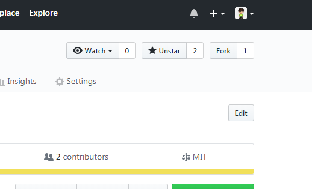
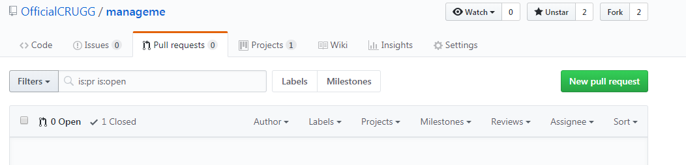

# How to Contribute \(Guide to Forking and making Pull-Requests\)


This guide is unfinished!


## Forking the repository

First you have to fork the repository by clicking on the little fork icon on the upper right corner.


If you get a windows, where GitHub should fork the repository, you should probably select your normal profile.


Now you can work on the repository, and make your changes.

## Creating the pull request

First click on the tab Pull Requests, then click on the big green buton "New pull request".

...

